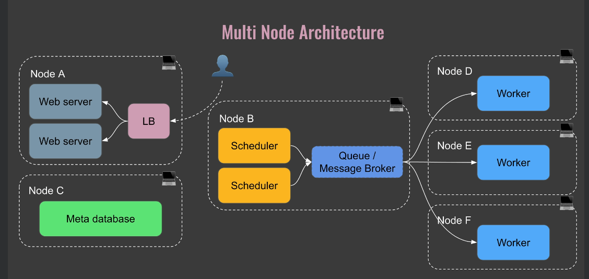

# 5. Why Airflow?
- Imagine you are the conductor of a symphony orchestra.
Each musician data task knows how to play their instrument, but it's your job to make sure they all
play in the right order and at the right time to create beautiful music.
A seamless data pipeline. Well, Apache Airflow is like having an automated conductor for your data tasks.
  - Set the order of your tasks
  - Makes sure each task starts only when the previous ones are done
  - Control the timing of your entire data process
- Organization : Example
  - Clean it, perform some calculations, and then generate a report.
Airflow helps you define this sequence and makes sure each step happens in the correct order, even
if some tasks take longer than others.
- Visibility : Your control tower
  -  helps you to monitor the progress of your workflows 
- Flexibility and Scalability: YOur swiss army knife
  - This flexibility allows you to connect to various data sources and tools, start small, and expand
as your projects grow and customize workflows to fit with your specific needs.
# 6. What is Airflow?
- Airflow is an open source platform to **programmatically author, schedule, and monitor** workflows.
- Airflow is a tool that helps you create, organize, and keep track of your data tasks
automatically. It's like a **smart to do list** for your data work that runs itself.
- 
- 

# 7. Core Components
- **Component 1 The Web Server** : THe web server provides the user interface(IU) you see when you use Airflow. it allows you to view, manage and monitor your workflows through a web browser.
- **Component 2 The Scheduler** : The scheduler is responsible for determining when tasks should run. It ensures your tasks run at the right time and in the correct order.
- **Component 3 The Meta Database** : This is database that stores information about your tasks and their status.. it keeps track of all the important details about your workflows.
- **Component 4 The Triggerer**:  The triggerer is responsible for managing deferrable tasks= tasks that wait for external events. It allows Airflow to efficiently handle tasks that depend on external factors without blocking other processes.
- **Component 5 The Executor** : The executor determines how your tasks will be run. It manages the execution of your tasks, deciding whether to run them in sequence or in parallel and on which system.
- **Component 6 The Queue** : The queue is a list of tasks waiting to be executed. It helps manage the order of task execution, especially when there are many tasks to run.
- **Component 7 The Worker**: Workers are the processes that actually perform the tasks They do the actual work defined in your tasks.

# 8. Core Concepts
- Concept 1 The DAG(Directed Acyclic Graph) : A DAG is collection of all the tasks you want to run, organized in a way that reflects their dependencies. It helps you define the structure of your entire workflow, showing which tasks need to happen before others.
- 
- Concept 2 Operator : An operator defines a single, ideally idempotent, task in your DAG. Operators allow you to break down your workflow into discrete, manageable pieces of work.
- 
- Concept 3 Task / Task instance : A task is a sepcific instance of an operator. When an operator is assigned to a DAG, it becomes a task.Tasks are the actual units of work that get executed when your DAG runs.
- Concept 4 Workflow: A workflow is the entire process defined by your DAG, including all tasks and their dependencies. It represents your entire data pipeline showing how all the pieces fit together to achieve your goal.
- 

# 9. Airflow is not...
- Airflow is not designed to process large volumes of data itself. It's an orchestrator, not a data processing engine.
- Then airflow is not a real time streaming solution.  Airflow is built for batch processing and scheduling, not for handling real time data streams.
- Airflow is not a data storage system, while airflow uses a database to store metadata.

- Airflow isn't designed for such high frequency scheduling. Airflow is better for tasks that run at intervals of minutes, hours, or days.
- If you need to perform complex calculations on terabytes of data, Airflow itself isn't the tool to do the processing. Airflow is meant to orchestrate such jobs, not perform them.
- airflow might not be the best option for you is if you need real time data streaming.
-  if you have a simple linear workflow with few dependencies, airflow might be a little bit overkill for that.
- The power of airflow comes from managing complex dependencies and parallelism for very simple workflows.
# 10. The Different Architectures
- **Single node architecture** :single node architecture means all components of airflow are running on one machine.
- 
 **Now you may wonder how do they communicate between each other?**
  - They all communicate using the Metadatabase.
-  **multi-node  architecture** : Multi-node refers to running airflow across multiple computers or servers rather than just one.
- 
- 

# 11. How does it work?
1. (red) You write your Dag file, let's call it Daily Report Magpie and place it in the DAGs folder.
2. (yellow) Then the scheduler regularly scans the DAGs folder. The scheduler sees that your Dag is ready to run based on its schedule or dependencies.
3. (green)  So the scheduler creates a diagram, which is an instance of your Dag at a given time, and it marks the Dag run as queued in the meta database.
4. (blue)  Then the scheduler sends the task instance to the executor and its status is queued in the meta database. Remember that the executor does not execute tasks.

# 12. [Practice] Installing Apache Airflow

#  13. What is Docker?
- Docker is a tool that helps package and run software.
  - packaging : Docker lets you package your entire application, including the code, all the libraries it needs, and even the operating system it runs on into a single unit called a container.
  - consistency : A docker container works the same on any computer that can run Docker.
  - isolation : Each Docker container is isolated from others.
  - efficiency : Docker containers are lightweight. They share resources with the host computer more efficiently than traditional methods.
  - 
  - **In a sense, Docker is like a universal packaging system for software It ensures that your application, along with everything it needs to run, is bundled up neatly and can be run anywhere, anytime, exactly as we intended.**

# Key Takeaways

What should you keep in mind after what you've learned?

Airflow is an orchestrator, not a processing framework. Process your gigabytes of data outside of Airflow (i.e. You have a Spark cluster, you use an operator to execute a Spark job, and the data is processed in Spark).

A DAG is a data pipeline, an Operator is a task.

An Executor defines how your tasks are executed, whereas a worker is a process executing your task

The Scheduler schedules your tasks, the web server serves the UI, and the database stores the metadata of Airflow.

