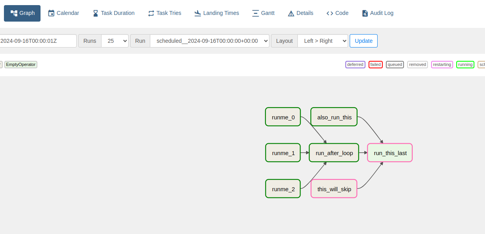
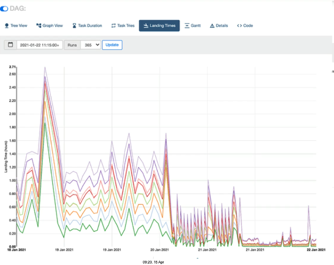
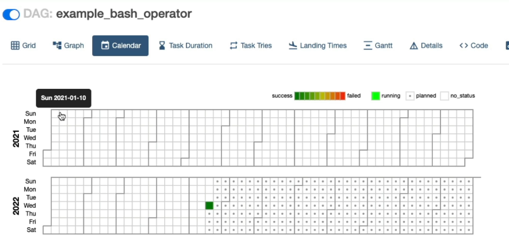
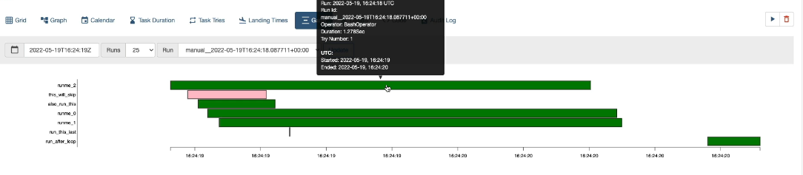
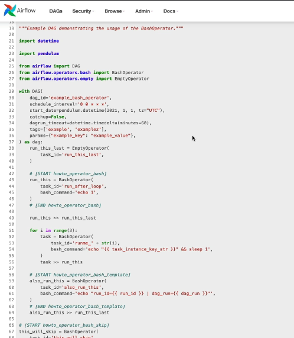

# 16. The DAGs View

# 17. The Grid View

# 18. The Graph View
- The graph view is extremely nice because it allows you to check your dependencies for your data pipeline.
- 
# 19. The Landing Times View
- execute more and more tasks, you will see how long does it take for every task in your diag to complete from the state scheduled to the completion? So success failures and so on.
- 
# 20. The Calendar View
-  this calendar and for each square you have the aggregation of the states, of the diagrams for a specific dag, for a specific day, which is extremely useful because you can quickly spot patterns
over the time. For example, if you see that often during the weekends, you have red squares, so a lot of failures, then you may need to do something about your weekends.
- 
# 21. The Gantt View
- And I strongly advise you to take a look at this view as well, because it gives you a nice overview
of the time it takes for your tasks to complete, as well as if there is any bottleneck in your data
pipeline. **Indeed, the longer the rectangle is, the longer it took to complete your task.**
So **if you have a huge rectangle**, well, **you may need to take a look at this task and try to find a
way to improve the time** it takes to complete it and so reduce the time it takes to complete your data
pipeline. In addition, **if you see some rectangles overlapping, that means you are able to execute multiple tasks
at the same time.**
- 
# 22. The Code View
-  it is very useful when you make modification to your DAG and you want to make sure that this
modification has been taken into account by airflow. So just by looking at the code here of your DAG, you are sure that your modification is applied to
your dag and you are safe to go.
- 
