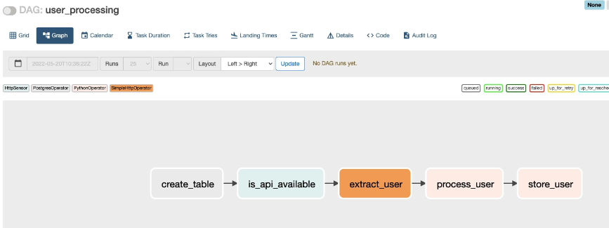
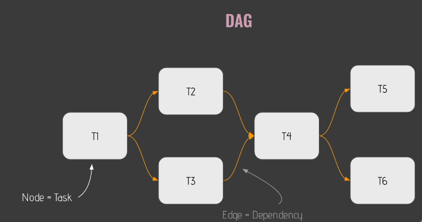
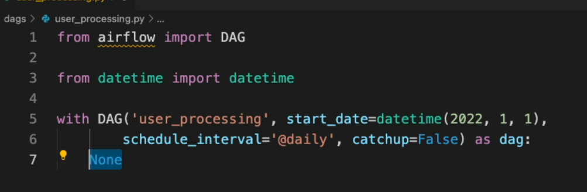
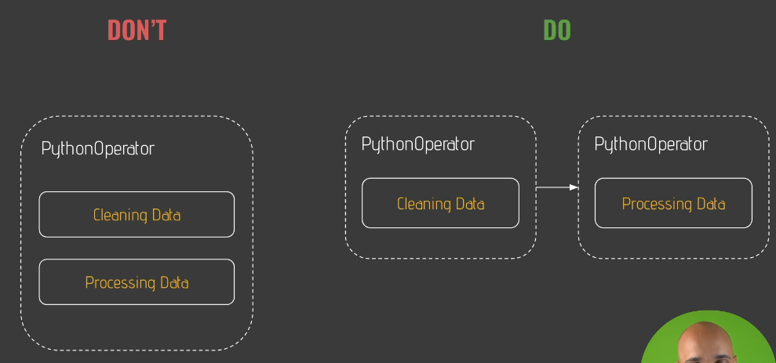
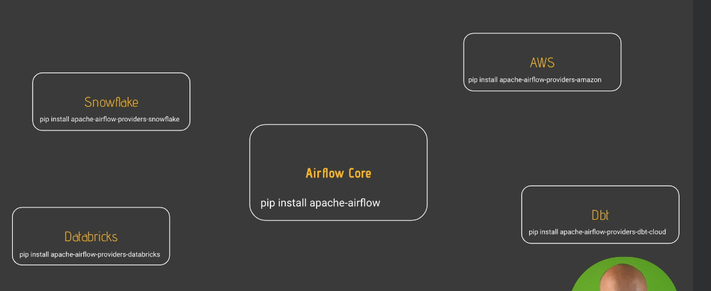
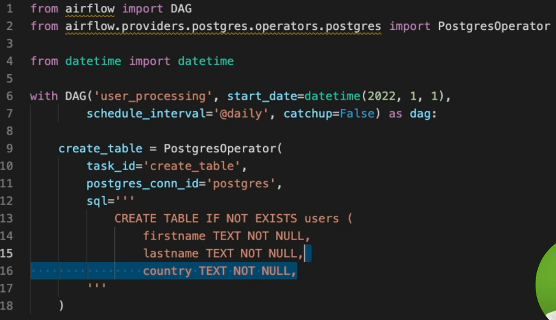
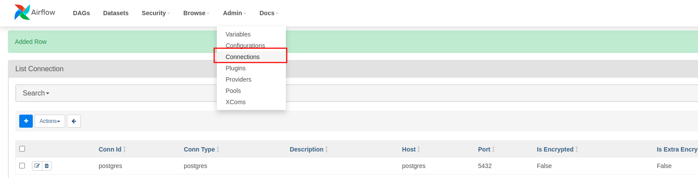
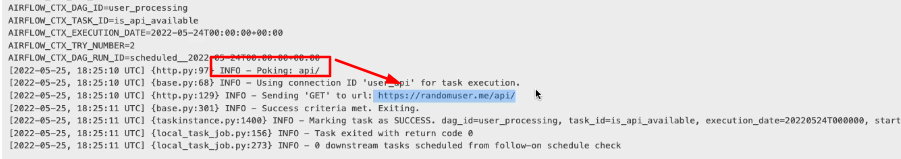
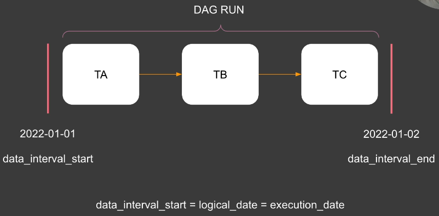
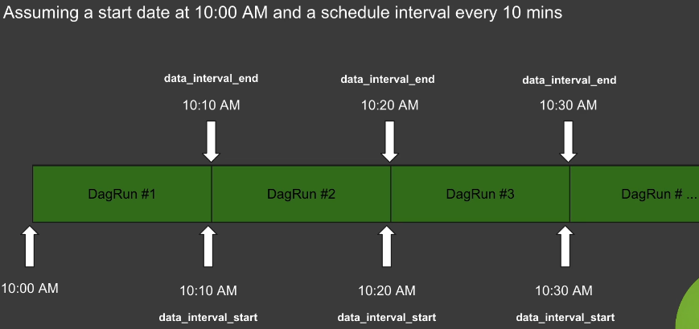

# 24. The Project

- 
- 1. create a table with the Postgres
- 2.  see how to check if an API is available or not
- 3.  discover special kind of operators that helps you to wait for something to happen before moving to the next task.

# 25. Advices

# 26. What is a DAG?

- 

# 27. DAG Skeleton

- 

```
from airflow import DAG
from datetime import datetime

with DAG('user_processing', start_date=datetime(2023, 1, 1),
        schedule_interval='@daily', catchup=False) as dag:
            None
```

# 28. What is an Operator?

- 
- 
- 3 types of operator
  - Action Operators : **Execute** an action
    - An action operator executes a function basically like the python operator, to execute a python function.
  - Transfer Operators : **Transfer** data
    - transfer operators that are in charge of transferring data between point A to point B or between source A to test B.
  - Sensors: **Wait** for a condition to be met
    - they allow you to wait for an event, to wait for something to be true before moving to the next task.

# 29. Providers

- 
- by installing those providers, you add new functionalities and interactions from your data pipelines.

# 30. Create a Table

- 
- I prefer to keep the same name for both the variable name and the task ID.
  The task ID here is the unique identifier of your task. You always have to define a task ID and it must be unique across all of the tasks that you have in the same DAG.
- If not exists users if not exist is very important here. Because if you don't use it and run the task twice, you are going to end up with an error saying that this table already exists.

# 31. Create a connection

- 
- Make connection with postgres

# 32. The secret weapon!

```
from airflow import DAG
from datetime import datetime
from airflow.providers.postgres.operators.postgres import PostgresOperator

with DAG(
    dag_id="user_processing",
    start_date=datetime(2023, 1, 1),
    schedule_interval="@daily",
    catchup=False
) as dag:
    create_table = PostgresOperator(
        task_id="create_table",
        postgres_conn_id="postgres",
        sql='''
        CREATE TABLE IF NOT EXISTS users (
            firstname TEXT NOT NULL,
            lastname TEXT NOT NULL,
            country TEXT NOT NULL,
            username TEXT NOT NULL,
            password TEXT NOT NULL,
            email TEXT NOT NULL
        );
        '''
    )
```

```commandline
airflow -h : help
sudo docker compose ps : see compose list
docker exec -it materials_airflow-scheduler_1 /bin/bash : Start
airflow tasks test user_processing create_table 2023-01-01 : run the specific task (create_table task)
exit : exit

```

# 33. What is a Sensor?

- Sensor : files to land at a specific location or entries in a circle table.
- **poke_interval** : 60 seconds by default. every 60 seconds the sensor checks if the condition is true or not before executing the next task.
- timeout :7 days by default. always define the timeout for your sensor and obviously it tells in seconds when your sensor times out and fails.
- 
- It means that every 60 seconds it box it verifies if that URL is valid or not. They wait for something to happen before executing the next task.

# 34. Is the API available?

- sensor :a special kind of operators, sense of wait for something to happen before moving to the next task.
- And in this case, we want to verify if the API is available or not. And for that we use the HTTP sensor.

```commandline
from airflow.providers.http.sensors.http import HttpSensor

    is_api_available = HttpSensor(
        task_id="is_api_available",
        http_conn_id="user_api",
        endpoint="api/"
    )

```

# 36. Extract users

```commandline
from airflow.providers.http.operators.http import SimpleHttpOperator
import json

# extract the data from that API.

extract_user = SimpleHttpOperator(
    task_id='extract_user',
    http_conn_id='user_api',
    endpoint='api/',
    method='GET',
    response_filter=lamda response: json.loads(response.text),
    log_response=True
)
```

# 37. Process users

- The python operator allows you to execute a python function and we are going to do it right now.

```commandline
#ti = task instance. we need that parameter to pull the data that has been downloaded by the task extract.

def _process_user(ti):
    user = ti.xcom_pull(task_ids='extract_user')
    user = user['results'][0]
    processed_user = json_normalize({
        'firstname': user['name']['first'],
        'lastname': user['name']['last'],
        'country': user['location']['country'],
        'username': user['login']['username'],
        'password': user['login']['password'],
        'email': user['email']
    })
    processed_user.to_csv('/tmp/processed_user.csv', index=None, header=False)


 # process the data and store it in a csv file
    process_user = PythonOperator(
        task_id="process_user",
        python_callable= _process_user
    )

 # give order
 create_table >> is_api_available >> extract_user >> process_user
```

# 38. Before running process_user
create_table >> is_api_available >> extract_user >> process_user

# 39. What is a Hook?
- Let's imagine that you have the operator and you want to execute a SQL request to a PostgreSQL database. you can execute a SQL request, but behind the scene a postgres hook is used and the goal of the post was hook is to obstruct all the complexity of interacting with a Postgres database. So keep in mind, whenever you interact with an external tool or an external service, you have a hook.

```
from airflow.providers.postgres.hooks.postgres import PostgresHook

def _store_user():
    hook = PostgresHook(postgrws_conn_id='postgres')
    hook.copy_expert("COPY users FROM stdin WITH DELIMITER as ','", 
    filename = '/tmp/processed_user.csv')

    store_user = PythonOperator(
        task_id="store_user",
        python_callable=_store_user
    )

```
- 작업 절차:
Postgres Hook 가져오기: 먼저 PostgresHook을 import합니다.

Python 함수 생성: _store_user라는 Python 함수를 만들어 PostgresHook을 사용하여 데이터베이스와 상호작용합니다.

Hook 객체 생성: 함수 안에서 PostgresHook 객체를 인스턴스화합니다. 이때, 연결 ID로 이전에 설정한 postgres를 사용합니다.

CSV 파일 데이터를 테이블에 복사: PostgresHook 객체에서 copy_expert 메서드를 호출합니다. 이 메서드는 CSV 파일의 데이터를 PostgreSQL 테이블로 복사하는 작업을 수행합니다.

SQL 쿼리는 "COPY users FROM 'processed_user.csv'" 형식으로 작성하며, processed_user.csv 파일을 PostgreSQL의 users 테이블에 복사합니다.

마지막 단계:
이제 PythonOperator를 사용하여 해당 작업을 연결합니다.

store_user라는 작업(task)을 정의하고, PythonOperator를 사용하여 작업 ID를 store_user로 설정합니다.
해당 작업에서 앞서 만든 _store_user 함수를 호출합니다.
이렇게 하면, 처리된 사용자 데이터를 CSV 파일에서 PostgreSQL의 users 테이블로 복사하는 작업이 성공적으로 완료됩니다.

중요한 점:
copy_expert 메서드는 PostgresOperator에서 사용할 수 없고, Postgres Hook을 통해서만 사용할 수 있습니다. 그래서 Hook을 잘 활용하는 것이 중요합니다. Hook에서 제공하는 다양한 메서드를 확인하는 것이 좋습니다.

# 40. Store users

# 41. Order matters!

# 42. Your DAG in action!
- run the works
```
# get list from docker
sudo docker-compose ps

# execute container from docker
sudo docker -it **name of countainer** /bin/bash

#check what is inside
ls /tmp

# check database. execute container from docker
psql -Uairflow
type psql query.

```

# 43. DAG Scheduling
- start_date : The timestamp from which the scheduler will attempt to backfill
- schedule_interval: How often a Dag runs
- end_date : The timestamp from which a DAG ends

```
with DAG(
    dag_id="user_processing",
    start_date=datetime(2023, 1, 1),
    schedule_interval="@daily",
    catchup=False) as dag:
```
- 
- 
- 

# 44. Backfilling: How does it work?
- 
Airflow의 핵심 메커니즘 중 하나를 설명해 드리겠습니다.

데이터 파이프라인 예시: 매일 자정에 트리거되는 데이터 파이프라인이 있다고 가정해 보겠습니다. 이 파이프라인의 시작 날짜는 2022년 1월 3일이고, 현재 날짜는 2022년 1월 7일입니다.

첫 번째 실행: 이 DAG(Directed Acyclic Graph, 작업 흐름)를 처음 실행하게 되면, 스케줄러는 지금까지 실행되지 않은 기간(즉, 시작 날짜와 현재 날짜 사이의 차이)을 자동으로 실행합니다. 이렇게 되면 1월 3일부터 7일까지의 DAG들이 실행됩니다. 이것이 캐치업(catch up) 메커니즘입니다.

캐치업 메커니즘: 캐치업 메커니즘은 DAG이 마지막으로 트리거된 시간과 현재 날짜 사이의 트리거되지 않은 DAG 실행을 자동으로 실행시킵니다. 예를 들어, DAG을 이틀 동안 일시 중지하고 다시 시작하면, 이 이틀 동안 실행되지 않은 DAG들이 실행됩니다.

백필링(backfilling) 메커니즘: 백필링 메커니즘은 과거의 DAG을 실행하는 기능입니다. 예를 들어, 2022년 1월 1일부터 1월 3일 사이의 DAG을 실행하고 싶다면, 이를 백필링할 수 있습니다. airflow dags backfill 명령어를 사용하여 이러한 과거 DAG 실행을 트리거할 수 있습니다.

캐치업 메커니즘 조정: 캐치업 메커니즘의 동작을 DAG 레벨에서 catchup=False로 설정하여 수정할 수 있습니다. 이렇게 설정하면 마지막으로 트리거되지 않은 DAG 실행만 실행됩니다. 이 기능은 과거에 트리거되지 않은 DAG들을 자동으로 다시 실행할 수 있게 해주는 매우 강력한 기능입니다.

이 설명을 통해 Airflow의 캐치업과 백필링 메커니즘이 어떻게 작동하는지 쉽게 이해할 수 있을 겁니다.

# 45. Wrap up!
Now you are able to:

Define a Data Pipeline

Execute a SQL request with the PostgresOperator

Execute a Python function with the PythonOperator

Execute an HTTP request against an API

Wait for something to happen with Sensors

Use Hooks to access secret methods

Exchange data between tasks


