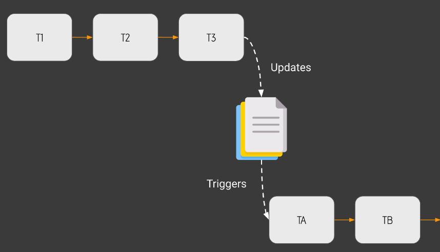
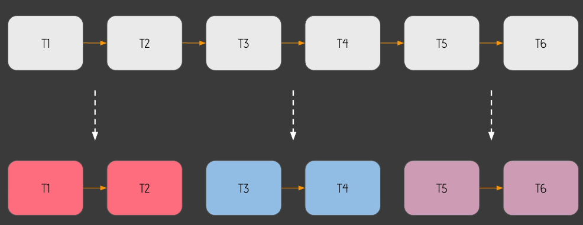
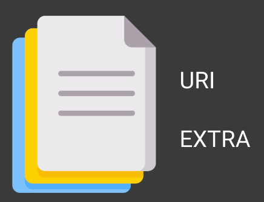
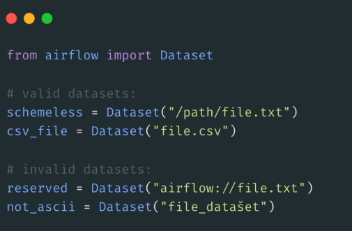
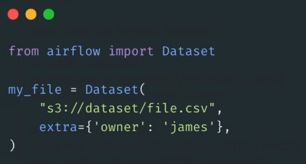
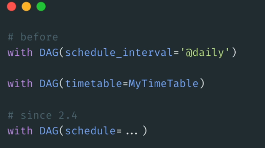
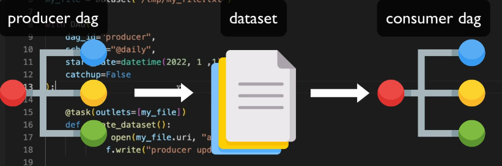
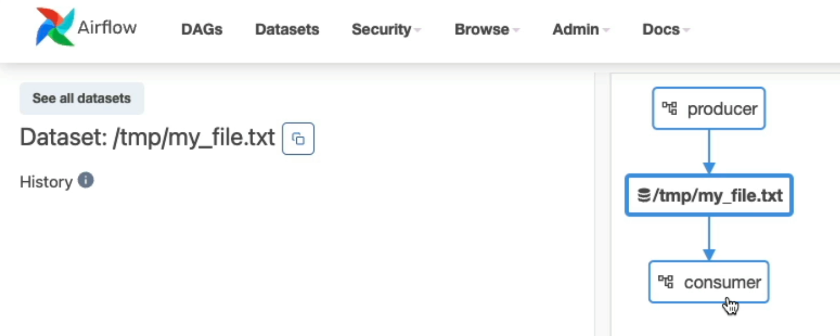
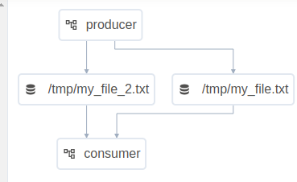

# 46. Why do you need that feature?

- 
- Intead of triggering TA TB after T1 T2 T3, make middle point file(updates) and that triggers next TA TB TC.
- 
- you can create micro pipelines. Basically you divide that big data pipeline into many smaller data pipelines where each one is dedicated to a given team with a given file and those micro pipelines, they are dependent to each other.

# 47. What is a Dataset?

- 
- URI : Unique identifier of your data, path to your data.
  - ig. S3 bucket : s3://folder/filename , Local file : /user/airflow/something
- Must composed of only ASCII characters
- The URI scheme cannot be airflow
- Case sensitive
- 
- if you have extra parameter?
- 

# 48. Adios schedule_interval!

- 
- That being said, you had those two parameters scale, interval and timetable. Now they are all gone. You have only one parameter which is schedule.

# 49. Create the Producer DAG
- Produce DAG :
 In Airflow, a **Producer** is a DAG (Directed Acyclic Graph) responsible for generating or updating data. The **Producer DAG** creates or modifies a dataset (such as a file or a database table), making it available for other DAGs to use.

For example, a **Producer DAG** might write data to a specific file, which can then be processed or analyzed by another DAG, often referred to as a **Consumer DAG**. The **Producer** handles the actual creation or modification of data, and it communicates this to Airflow using the **outlets** parameter.

### Summary:
- **Producer DAG**: The DAG that creates or modifies data.
- **Outlets**: A parameter that informs Airflow that this DAG has updated a dataset.
- **Consumer DAG**: The DAG that uses the data generated by the Producer.

The relationship between Producer and Consumer is that one generates the data, while the other consumes or utilizes it.

Here's how you can implement **datasets** in an Airflow DAG by following these steps to create a **Producer DAG** that updates a dataset:

### 1. **Create a new DAG file**

First, create a new file named `producer.py` inside the `dags` folder.

### 2. **Import necessary modules and objects**

To define the DAG and use datasets, import the required modules:

```python
from airflow import DAG
from airflow.decorators import task
from airflow.datasets import Dataset
from datetime import datetime
```

- `DAG`: Used to define a DAG.
- `task`: Allows you to define Python operator tasks more efficiently.
- `Dataset`: Represents a dataset object in Airflow.
- `datetime`: Used to set the start date of the DAG.

### 3. **Define the dataset**

Now, define the dataset. In this example, a file located at `/tmp/my_file.txt` is used as the dataset.

```python
my_file = Dataset("/tmp/my_file.txt")
```

- The `Dataset` object requires a **URI**, which is the path to the file or table that the task will interact with.

### 4. **Define the DAG**

Now, define the DAG with the `dag_id` set to `producer`, and configure it to run every day at midnight.

```python
with DAG(
    dag_id="producer",
    schedule="0 0 * * *",  # Runs daily at midnight
    start_date=datetime(2022, 1, 1),
    catchup=False,
) as dag:
```

- `schedule`: This parameter replaces the deprecated `schedule_interval`. It uses a cron expression to schedule the DAG to run every day at midnight.
- `start_date`: Specifies the start date of the DAG.
- `catchup`: Set to `False` to avoid running past missed DAG runs.

### 5. **Define the task**

Use the `@task` decorator to define a task that appends data to the file.

```python
    @task
    def update_dataset():
        with open(my_file.uri, "a+") as f:  # Open the file in append mode
            f.write("Producer update\n")    # Add content to the file
    update_dataset()         # execute function
```

- `update_dataset`: The task opens the file and writes `"Producer update"` to it.
- `my_file.uri`: Retrieves the file path from the dataset object.

### 6. **Set outlets to indicate the dataset update**

The last step is to let Airflow know that this task updates the dataset by using the `outlets` parameter:

```python
    update_dataset.outlets = [my_file]
```

- `outlets`: This new parameter indicates that this task updates the dataset, and any DAG that depends on this dataset can be triggered after the update.

### Full code

```python
from airflow import DAG
from airflow.decorators import task
from airflow.datasets import Dataset
from datetime import datetime

# Define the dataset
my_file = Dataset("/tmp/my_file.txt")

# Define the DAG
with DAG(
    dag_id="producer",
    schedule="0 0 * * *",  # Runs daily at midnight
    start_date=datetime(2022, 1, 1),
    catchup=False,
) as dag:

    # Define the task
    @task
    def update_dataset():
        with open(my_file.uri, "a+") as f:
            f.write("Producer update\n")
    update_dataset()        

    # Run the task and set outlets
    update_dataset()
    update_dataset.outlets = [my_file]

    or

    @task(outlets=[my_file])
    def update_dataset():
        with open(my_file.uri, "a+") as f:
            f.write("Producer update\n")
```
# 50. Create the Consumer DAG

### **Consumer DAG**

Now that you have a **Producer DAG** that updates the dataset, you can create a **Consumer DAG** that depends on this dataset. This **Consumer DAG** will be automatically triggered once the **Producer DAG** successfully completes.



In the previous video, we created a **Producer DAG** that is responsible for updating a dataset, which will trigger the **Consumer DAG** that we are about to create. Here's how to set up the **Consumer DAG**:

### 1. **Create a Consumer DAG file**
Create a new file named `consumer.py` in the `dags` folder.

### 2. **Import necessary modules**
We need to import the required modules for using datasets:

```python
from airflow import DAG
from airflow.datasets import Dataset
from airflow.decorators import task
from datetime import datetime
```

- `DAG`: Used to define a DAG.
- `Dataset`: Imports the dataset object.
- `task`: Allows for easier definition of Python functions as tasks.
- `datetime`: Used to set the start date of the DAG.

### 3. **Define the dataset**
To use the same dataset as defined in the **Producer DAG**, copy the dataset definition line from `producer.py` and paste it here. Ensure you use the same URI, as it serves as a unique identifier for your dataset.

```python
my_file = Dataset("/tmp/my_file.txt")
```

### 4. **Define the DAG**
Now, define the DAG. This time, instead of scheduling it based on time intervals, we will base it on dataset updates:

```python
with DAG(
    dag_id="consumer",
    schedule=[my_file],  # Triggers the DAG when the dataset is updated
    start_date=datetime(2022, 1, 1),
    catchup=False,
) as dag:
```

- `schedule`: By setting this to the dataset `my_file`, the DAG will automatically trigger whenever the dataset is updated.
- `start_date`: Sets the start date for the DAG.
- `catchup`: Set to `False` to prevent running past DAG instances.

### 5. **Define the task**
Next, define a task that reads from the dataset:

```python
    @task
    def read_dataset():
        with open(my_file.uri, "r") as f:  # Open the file in read mode
            print(f.read())  # Print the contents of the file
```

- `read_dataset`: This task opens the dataset and prints its contents.
- `my_file.uri`: Retrieves the file path from the dataset object.

### 6. **Call the task**
Finally, call the task:

```python
    read_dataset()
```

Since this task only reads from the dataset and does not update it, there’s no need for the `outlets` parameter.

### Summary
- The **Consumer DAG** uses the updated dataset from the **Producer DAG**.
- Import the dataset object and use the same dataset URI defined in the **Producer DAG**.
- Set the DAG's schedule based on the dataset update.

With this setup, the **Consumer DAG** will be automatically triggered whenever the dataset is updated.


# 51. Track your Datasets with the new view!
- 
- know that these data set triggers to consume a DAG. So look at this view.
You will get the list of all datasets you have and a nice visualization of what dogs update, what data sets that trigger what also tags.


# 52. Wait for many datasets
- 
If you want to wait for updates from two datasets instead of just one, it's quite simple. Here’s how to do it:

### 1. **Modify the Producer DAG**
First, go back to the **Producer DAG** and create another dataset by copying the existing dataset definition line. Change the name to `my_file_2`.

```python
my_file_2 = Dataset("/tmp/my_file_2.txt")
```

### 2. **Copy the Update Task**
Copy the update task and modify it to update the new dataset. Rename it to `update_dataset_2` and use `my_file_2` in the function.

```python
@task
def update_dataset_2():
    with open(my_file_2.uri, "a") as f:
        f.write("Producer update for my_file_2\n")
```

### 3. **Call Both Update Tasks**
Now, call both update tasks in the DAG:

```python
update_dataset()
update_dataset_2()
```

### 4. **Modify the Consumer DAG**
Next, go back to the **Consumer DAG** and define the two datasets, `my_file` and `my_file_2`.

```python
my_file = Dataset("/tmp/my_file.txt")
my_file_2 = Dataset("/tmp/my_file_2.txt")
```

### 5. **Update the Schedule Parameter**
In the Consumer DAG, add both datasets to the schedule parameter:

```python
schedule=[my_file, my_file_2]
```

### 6. **Result**
Now, the **Consumer DAG** will be triggered only when both `my_file` and `my_file_2` are successfully updated. It won’t trigger if only one of them is updated.

After saving the changes, if you go back to the Airflow UI and check the datasets, you will see both `my_file` and `my_file_2`. The Producer will update both datasets to trigger the Consumer.

This way, you can configure the DAG to wait for updates from multiple datasets before it gets triggered.

# 53. Dataset limitations
- Dataset limitations
Datasets are amazing, but they have limitations as well:


DAGs can only use Datasets in the same Airflow instance. A DAG cannot wait for a Dataset defined in another Airflow instance.

Consumer DAGs are triggered every time a task that updates datasets completes successfully. Airflow doesn't check whether the data has been effectively updated.

You can't combine different schedules like datasets with cron expressions.

If two tasks update the same dataset, as soon as one is done, that triggers the Consumer DAG immediately without waiting for the second task to complete.

Airflow monitors datasets only within the context of DAGs and Tasks. If an external tool updates the actual data represented by a Dataset, Airflow has no way of knowing that.
