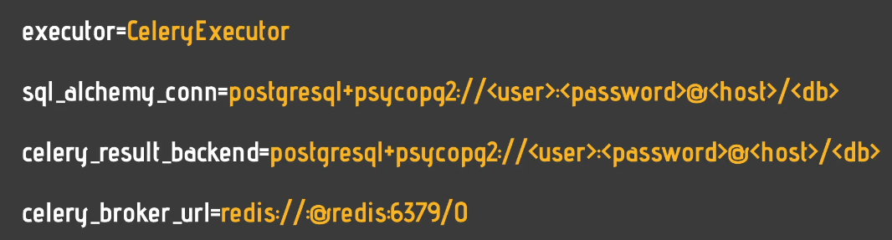
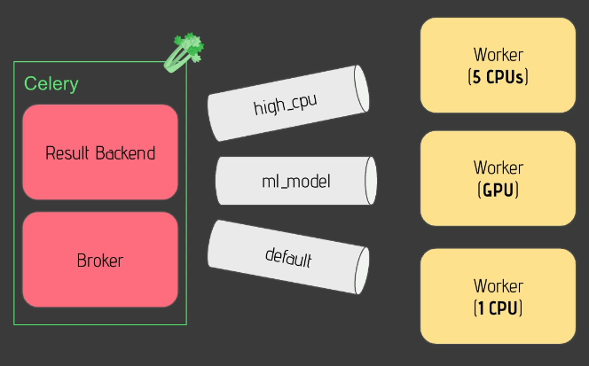
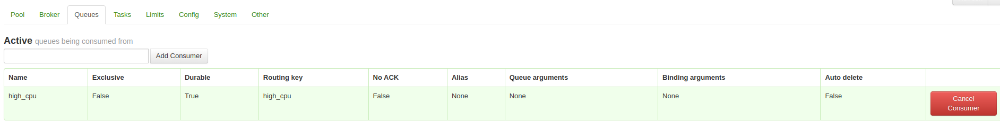

# 54. What's an executor?

1. **Executor Role**:

   - The executor doesn’t directly run tasks but defines **how and where** tasks are executed.

2. **Types of Executors**:

   - **Local Executors**:
     - **Local Executor**: Runs multiple tasks on a single machine.
     - **Sequential Executor**: Runs one task at a time on a single machine.
   - **Remote Executors**:
     - **Celery Executor**: Executes tasks on a **Celery cluster** across multiple machines.
     - **Kubernetes Executor**: Runs tasks on a **Kubernetes cluster**, distributing them across multiple machines and pods.

3. **Choosing an Executor**:

   - Select the appropriate executor based on your **use case** and **workload** (e.g., single machine vs. distributed system).

4. **Configuration**:
   - You configure the executor via the `executor` parameter in the Airflow configuration file (`airflow.cfg`).
   - Some executors (e.g., **Celery** and **Kubernetes**) require additional configuration parameters.

The main point is that the executor defines **how tasks are distributed** but doesn’t run them directly. Different executors suit different environments, like local machines, clusters, or cloud-based systems.

# 55. The default config

When running Airflow with Docker Compose, here’s what you need to know to access and modify the configuration file:

1. **Accessing the Airflow Configuration File**:

   - In your terminal, use `docker compose exec` to access the running Docker containers.
   - Then, copy the `airflow.cfg` configuration file from the scheduler container to your local machine with the following command:
     ```bash
     docker cp <scheduler_container_name>:/opt/airflow/airflow.cfg .
     ```
   - This copies the configuration file from the container to your machine, where you can edit it.

2. **Configuration File Structure**:

   - The `airflow.cfg` file contains multiple sections like `core`, `webserver`, `Kubernetes`, and others.
   - Each section contains settings you can modify, such as:
     - **DAGs folder**: Where your DAG files are stored.
     - **Parallelism**: The maximum number of tasks that can run simultaneously.
     - **Executor**: The type of executor to use (e.g., `SequentialExecutor`, `CeleryExecutor`).

3. **Modifying Executor in Docker Compose**:

   - By default, the Airflow configuration file might show the `SequentialExecutor`.
   - However, when using Docker Compose, the **executor** can be defined through **environment variables** in the `docker-compose.yaml` file.
   - In the `docker-compose.yaml` file, check the `environment` section for a line like this:
     ```yaml
     AIRFLOW__CORE__EXECUTOR: CeleryExecutor
     ```
   - This line overrides the executor defined in `airflow.cfg`. So even if the configuration file says `SequentialExecutor`, Docker Compose is using the **CeleryExecutor** in this case.

4. **Environment Variable Overrides**:
   - When you use environment variables (e.g., `AIRFLOW__CORE__EXECUTOR`), they override the values in the `airflow.cfg` file.
   - This is how Docker Compose modifies Airflow settings dynamically, ensuring you don’t need to edit `airflow.cfg` directly.

In summary, when using Docker Compose, **modify Airflow settings like the executor** via the `docker-compose.yaml` file by setting environment variables, which will override values in the `airflow.cfg` file inside the container.

# 56. The Sequential Executor
-

# 57. The Local Executor
- 

The **Local Executor** in Airflow is more advanced than the Sequential Executor because it allows the execution of multiple tasks simultaneously, but still on a single machine. 

Key points:

1. **Multiple tasks**: Unlike Sequential Executor, Local Executor can run multiple tasks in parallel.
2. **Database requirement**: It requires a more robust database like PostgreSQL, MySQL, or Oracle DB, instead of SQLite.
3. **Parallel task execution**: The scheduler can run tasks simultaneously. For example, after task T1 completes, T2 and T3 can run in parallel, and once they finish, T4 runs.
4. **Configuration**: You configure it by setting the executor to Local Executor and specifying the SQLAlchemy connection string to a proper database like Postgres.
5. **Scalability limitations**: The Local Executor is limited by the resources of the machine it's running on, so it doesn't scale well for larger workloads.

In summary, the Local Executor enables parallel task execution but is constrained by the hardware of a single machine.

# 58. The Celery Executor
- 
- 
The **Celery Executor** in Airflow is a more advanced option that allows you to scale out the number of tasks you can execute simultaneously by using a **Celery cluster**. Here’s how it works:

1. **Components**: You still have the core components—web server, scheduler, and metadata database (e.g., PostgreSQL)—but Celery adds extra parts.
   
2. **Workers**: Celery introduces **Airflow workers**—machines dedicated to executing tasks. For example, with three workers, you have three separate machines processing tasks. If more resources are needed, you can simply add more workers to handle more tasks.

3. **Task Distribution**: 
   - The scheduler sends tasks to a **broker** (a queue system).
   - Workers pull tasks from the broker, execute them, and update the task status in the **result backend**, typically the same metadata database or another database.
   - For example, when a DAG is triggered, task T1 is sent to the broker, a worker picks it up, executes it, and updates the result in the database. The same happens with other tasks (e.g., T2, T3) which are executed by different workers simultaneously.

4. **Queue and Backend**: 
   - **Broker**: A messaging queue where tasks are stored for workers to pull (e.g., Redis, RabbitMQ).
   - **Result backend**: Where the task status is stored after execution (usually the metadata database).

5. **Configuration**: To use the Celery Executor, you need to configure two additional settings:
   - **Celery result backend**: Where task results are stored.
   - **Celery broker URL**: The address of your message broker (e.g., Redis, RabbitMQ).

In summary, the Celery Executor is powerful because it allows tasks to be distributed across multiple machines, making it highly scalable for larger workflows. However, it requires additional setup, including a broker and workers.

# 59. The current config


# 60. Add the DAG parallel_dag.py into the dags folder
```
from airflow import DAG
from airflow.operators.bash import BashOperator
 
from datetime import datetime
 
with DAG('parallel_dag', start_date=datetime(2022, 1, 1), 
    schedule_interval='@daily', catchup=False) as dag:
 
    extract_a = BashOperator(
        task_id='extract_a',
        bash_command='sleep 1'
    )
 
    extract_b = BashOperator(
        task_id='extract_b',
        bash_command='sleep 1'
    )
 
    load_a = BashOperator(
        task_id='load_a',
        bash_command='sleep 1'
    )
 
    load_b = BashOperator(
        task_id='load_b',
        bash_command='sleep 1'
    )
 
    transform = BashOperator(
        task_id='transform',
        bash_command='sleep 1'
    )
 
    extract_a >> load_a
    extract_b >> load_b
    [load_a, load_b] >> transform
```

# 61. Monitor your tasks with Flower
- This passage explains how to access **Flower**, a web-based tool for managing and monitoring Celery clusters when using the Celery Executor with Airflow. To access Flower, you must restart Docker Compose by running specific commands. Once up, Flower can be accessed via `localhost:5555`.

In Flower's interface, you can quickly see the status of tasks (active, processed, failed, succeeded, or retried) and view details about the workers. If you click on a worker, you can see more information, including:

- **Pools**: You can define the number of tasks a worker can run simultaneously (default is 16).
- **Queues**: You can route specific tasks to particular workers, which is useful for resource-heavy tasks by creating and assigning queues.

Flower helps monitor and manage the execution of tasks, ensuring efficient task distribution across workers.

```
docker-compose --profile flower up -d
```

# 62. Remove DAG examples
Remove DAG examples
Remove DAG examples
To keep our Airflow instance nice and clean, we are going to remove the DAG examples from the UI

To do this

1. Open the file docker-compose.yaml
2. Replace the value 'true' by 'false' for the AIRFLOW__CORE__LOAD_EXAMPLES environment variables.
3. Save the file
4. Restart Airflow by typing docker-compose down && docker-compose up -d
5. Once it's done, go back to localhost:8080 and you should end up with something like this

# 63. Running tasks on Celery Workers

1. save the work

2. trigger DAG

3. check flower and check if thre is failed one or not

4. check which worker run for this job.


# 64. What is a queue?

The concept of a "queue" in computing and specifically in systems like **Apache Airflow** can be understood similarly to a real-world line, where tasks wait in an organized order to be executed.

### How a Queue Works:
- **Queue as a Task Line**: Imagine a line of people waiting to be served. In computing, a queue works similarly, except it's a line of **tasks** waiting to be processed or executed. These tasks are organized in a **FIFO (First In, First Out)** order, meaning the first task added to the queue will be the first one to get processed.
  
- **Queue in Airflow**: In Airflow, a queue is where tasks are **pushed** or sent, waiting for workers (machines) to execute them. For example:
  - Task 1 (**T1**) is added to the queue first.
  - Task 2 (**T2**) comes next.
  - They are processed in the order they were pushed: **T1**, then **T2**, and so on.

### Why Queues are Useful in Airflow:
- **Task Distribution**: Airflow is often used in distributed environments, meaning tasks are executed on multiple machines (called **workers**). Each worker may have different resources:
  - One worker may have **high CPU** capacity.
  - Another might have a **GPU** for machine learning tasks.
  - Some workers may have fewer resources.
  
  Queues allow you to decide **which worker should handle which tasks** based on their resource needs. 

#### Examples:
1. **Task Needing High CPU**:
   - If a task needs a lot of CPU power, it can be assigned to a **high-CPU queue**. The worker with more CPU resources will pick it up and execute it.
   
2. **Task Needing a GPU**:
   - If you have a machine learning model that requires a GPU, you can assign this task to an **ML queue**, which is connected to the worker with a GPU.

3. **Default Queue**:
   - Any task that doesn't have special resource requirements can go into a **default queue** and will be executed by a worker with fewer resources.

### Benefits:
- **Efficient Resource Management**: By using queues, Airflow can balance tasks across different machines based on what they need. This ensures that:
  - Tasks that need a lot of resources (like CPU or GPU) go to the right worker.
  - Tasks that need fewer resources don't overload powerful machines unnecessarily.
  
- **Scalability**: With queues, you can scale your infrastructure easily by adding more machines and distributing tasks more effectively.

### Summary:
Queues allow you to **distribute tasks** intelligently among machines with different resources, ensuring that tasks are executed efficiently, without overwhelming the workers. This helps in resource management, scaling, and optimizing the performance of your workflows in systems like Airflow.

# 65. Add a new Celery Worker
Before creating a queue, you need to add a new Celery worker to simulate multiple machines for task execution. In real-world scenarios, these Celery workers represent different machines that execute tasks.

### Steps:
1. **Edit the Docker Compose File**:
   - Open the Docker Compose file and find the section labeled `airflow-worker` under "services."
   - Copy the entire block of code for the `airflow-worker` service and paste it just below.
   - Rename the new worker by adding `-2` (e.g., `airflow-worker-2`).
   - Save the file.

2. **Restart Airflow**:
   - Run the command to restart the Airflow instance and wait for it to become operational.ㅣ

3. **Verify the Workers**:
   - Use the command to check your running Docker containers. You should now see two workers (`airflow-worker-1` and `airflow-worker-2`).

4. **Check Flower**:
   - Open Flower, the monitoring tool, and verify that both workers are visible.
   - This confirms you've successfully added a new worker, allowing you to execute more tasks.


In a real-world scenario with multiple physical machines, you'd run a specific command on each machine to register it as a worker, enabling it to execute tasks.

# 66. Create a queue to better distribute tasks
Creating a queue in Airflow is straightforward. You can specify a queue by adding an option to the Celery worker command.


### Steps to Create a Queue:
1. **Specify Queue in Worker Command**:
   - Use the `-q` (queue) option when starting a Celery worker to create a new queue.
   - For example, to create a queue for machine learning tasks, you could specify a queue called `ML`, or for high CPU tasks, you could use `high_CPU`.
   
2. **Assign Queue to Worker**:
   - By doing this, you assign the new queue (e.g., `high_CPU`) to a specific worker.
   - The original worker (e.g., `airflow-worker-1`) will continue to handle the default queue, while the new worker (e.g., `airflow-worker-2`) will only execute tasks from the newly created queue (`high_CPU`).

3. **Restart Airflow**:
   - After modifying the worker configuration, save the changes and restart the Airflow instance using the restart command.
   - Wait for Airflow to be fully up and running.

4. **Check Queues in Flower**:
   - Open Flower (the Celery monitoring tool) and click on your first worker to check its queues. It will be responsible for the **default queue**.
   - Then, check the new worker and confirm that it is assigned to the **high_CPU queue**.

Now you have one worker executing tasks from the default queue and another worker handling tasks in the high CPU queue.



### Next Step: Defining Task Queues
To specify which queue a particular task should be sent to, you will need to define the task's queue in your DAG (Directed Acyclic Graph) configuration. Let's look into that next.

# 67. Send a task to a specific queue
In Airflow, by default, tasks are sent to the **default queue** unless specified otherwise. This default behavior is controlled by the `default_queue` parameter, which is typically set to `"default"` under the **operators section** in the configuration.

### Steps to Use a Different Queue (e.g., `high_CPU`):
1. **Default Behavior**:
   - When you execute a task in Airflow, it goes to the **default queue**, which is why when you check in **Flower**, you'll see that the default queue is being used by the worker.

2. **Assigning a Task to a Different Queue**:
   - If you want to send a task to a different queue (for example, `high_CPU`), you simply need to modify the DAG for that specific task.
   - In the task's definition, you add the parameter `queue` with the value `"high_CPU"`.
   - By default, other tasks will continue using the `default` queue, so you don't need to specify anything for them unless you want them to use a different queue.

### Example: Assigning `high_CPU` to a Task
For the task `transform`, you can define it like this:
```python
transform_task = BashOperator(
    task_id='transform',
    bash_command='sleep 30',
    queue='high_CPU',  # Assigning the task to the high_CPU queue
    dag=dag,
)
```

3. **Running the DAG**:
   - After making this change, save the DAG file and trigger the DAG in the Airflow UI by clicking on **Trigger DAG**.
   - Go to **Flower** to monitor the workers. You'll see that some tasks are processed by the first worker using the default queue.

4. **Monitoring the `high_CPU` Queue**:
   - If you wait a bit, you'll see that the `transform` task (which was assigned to the `high_CPU` queue) will be picked up by the second worker, which is responsible for the **high_CPU queue**.

### Summary:
You've successfully:
- Added a new Celery worker,
- Created a new queue (`high_CPU`),
- Attached that queue to a specific worker,
- And sent resource-intensive tasks to that worker by assigning them to the `high_CPU` queue.

This is especially useful when you have tasks that require more resources and need to be processed by more powerful workers.


# 68. Concurrency, the parameters you must know!

Concurrency, the parameters you must know!
Concurrency, the parameters you must know!
Airflow has several parameters to tune your tasks and DAGs concurrency.

Concurrency defines the number of tasks and DAG Runs that you can execute at the same time (in parallel)


Starting from the configuration settings

parallelism / AIRFLOW__CORE__PARALELISM

This defines the maximum number of task instances that can run in Airflow per scheduler. By default, you can execute up to 32 tasks at the same time. If you have 2 schedulers: 2 x 32 = 64 tasks.

What value to define here depends on the resources you have and the number of schedulers running.


max_active_tasks_per_dag / AIRFLOW__CORE__MAX_ACTIVE_TASKS_PER_DAG

This defines the maximum number of task instances allowed to run concurrently in each DAG. By default, you can execute up to 16 tasks at the same time for a given DAG across all DAG Runs.


max_active_runs_per_dag / AIRFLOW__CORE__MAX_ACTIVE_RUNS_PER_DAG

This defines the maximum number of active DAG runs per DAG. By default, you can have up to 16 DAG runs per DAG running at the same time.


